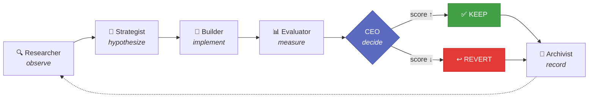
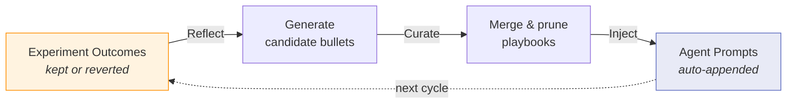
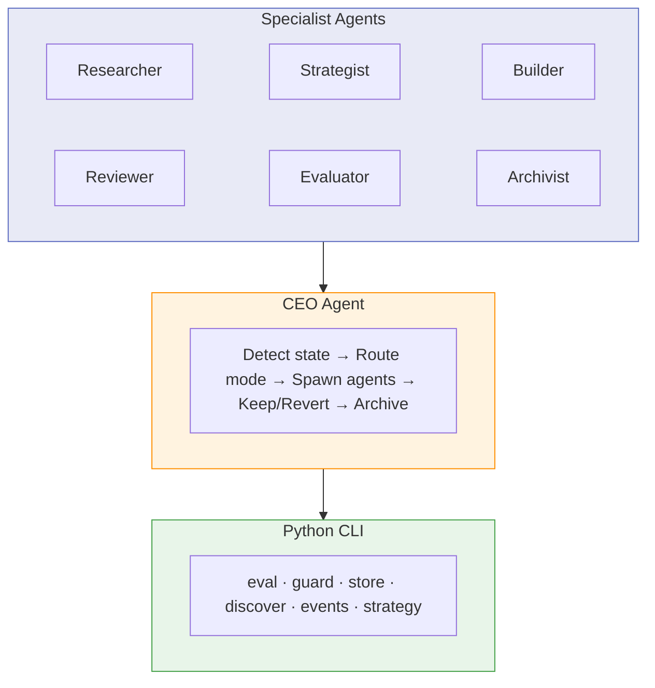
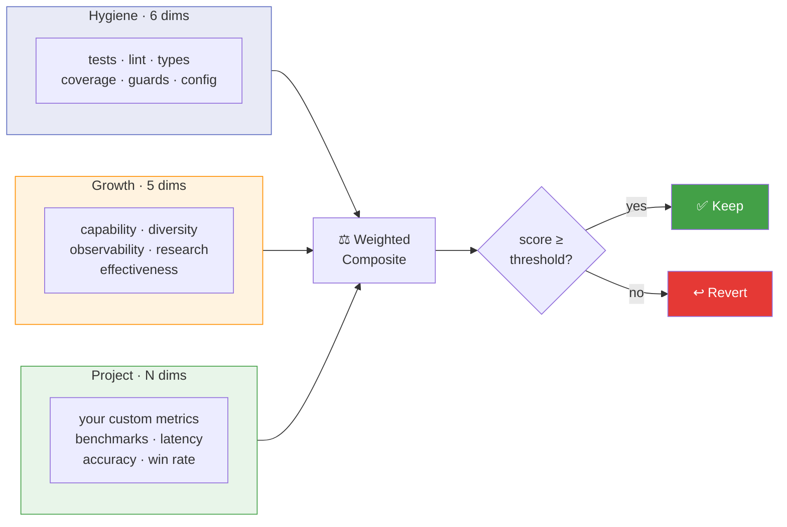

# The Factory: From Idea to Evolving Software

[](https://github.com/akashgit/remote-factory/actions/workflows/ci.yml)
[](https://www.python.org/downloads/)
[](LICENSE)

**Describe what you want. The Factory builds it, tests it, and keeps improving it — autonomously.** You can hand it a one-line prompt, a detailed spec, a path to an idea file, or an existing codebase. The Factory researches best practices, scaffolds the project, sets up evaluation, and then runs a continuous improvement loop — measuring every change and keeping only what makes things better. The agents that do this work learn from every experiment and get sharper over time.

```bash
# Got an idea? Describe it.
factory ceo --prompt "Build a CLI that converts CSV to JSON with streaming support"

# Have an idea written up in a file? Pass the path.
factory ceo ~/ideas/weather-dashboard.md  # reads the file as the build spec

# Already have a repo? Point the factory at it.
factory ceo ~/my-project

# Leave it running. Come back to a better codebase.
factory run ~/my-project --loop
```

Under the hood, a CEO agent orchestrates six specialists — Researcher, Strategist, Builder, Reviewer, Evaluator, Archivist — each running as an independent [Claude Code](https://docs.anthropic.com/en/docs/claude-code) subprocess. Every change is a hypothesis: scored before and after, kept only if it improves the score, archived as institutional memory. Failed experiments aren't wasted — they teach the agents what to avoid next time.

## How It Works



Each cycle produces a measurable, auditable experiment. The Researcher observes the project, the Strategist generates ranked hypotheses using [FEEC priority](docs/architecture.md) (Fix > Exploit > Explore > Combine), the Builder implements one on an experiment branch, the Evaluator scores before/after, and the CEO decides keep or revert. The Archivist records every outcome for cross-project learning.

## Self-Evolving Agents

The factory doesn't just improve your project — it improves *itself*. Every keep/revert decision becomes training data for the next cycle.

This is powered by **ACE (Autonomous Context Engineering)** — inspired by Anthropic's work on [context engineering](https://www.anthropic.com/engineering/effective-context-engineering-for-ai-agents) — a Reflect → Curate → Inject loop that evolves agent playbooks from real experiment outcomes:



Each agent accumulates behavioral rules — DOs and DON'Ts — with evidence counters. Rules that correlate with kept experiments get reinforced. Rules that correlate with reverts get pruned. The playbooks are human-readable markdown you can inspect and override.

```bash
# Run a full improvement cycle, then evolve all agent playbooks
factory ceo ~/my-project --mode meta
```

Meta mode is the factory's recursive self-improvement: improve the project, then improve the agents that improved the project. Over time, agents get sharper at the specific kinds of changes that work for *your* codebase. See [ACE Self-Improvement](docs/ace.md) for details.

## Quick Start

```bash
# Install from source (recommended — the factory evolves fast)
git clone https://github.com/akashgit/remote-factory.git
cd remote-factory && uv sync && uv tool install -e .

# Register the CEO as a Claude Code agent
factory install

# Set up the Obsidian vault (highly recommended — gives the factory persistent memory)
export FACTORY_VAULT_PATH=~/factory-vault
factory vault-init

# Build something
factory ceo --prompt "Build a REST API for bookmark management with tags and search"
```

**Prerequisites:** Python 3.11+ and [Claude Code](https://docs.anthropic.com/en/docs/claude-code) (installed and authenticated). See the [full setup guide](docs/setup.md).

**Why Obsidian?** The vault is the factory's long-term memory. Experiment history, cross-project insights, research notes, and agent learnings all live there. Without a vault, the factory still works but starts fresh every time. See [Obsidian setup](docs/setup.md#optional-obsidian-vault).

## What Can It Do?

**Build from nothing** — give it an idea, it does the rest:

| Input | What happens |
|-------|-------------|
| `factory ceo --prompt "Build a weather CLI"` | Researches best practices, scaffolds the project, sets up tests and eval, then improves it |
| `factory ceo ~/ideas/my-idea.md` | Reads the file as the build spec and builds the project end-to-end |
| `factory ceo https://github.com/user/repo` | Clones the repo, discovers what it does, sets up evaluation, then starts improving |

**Improve what exists** — point it at any codebase:

| Input | What happens |
|-------|-------------|
| `factory ceo ~/my-project` | Discovers eval dimensions, then runs measured improvement cycles |
| `factory ceo ~/my-project --focus "auth"` | Narrows all hypotheses to a specific area |
| `factory run ~/my-project --loop` | Continuous background improvement — runs every 30 min |
| `factory ceo ~/my-project --mode meta` | Improves the factory's own agent playbooks (recursive self-improvement) |

## Architecture

Three layers, strict separation of concerns:



The CEO detects your project's state and chooses the right mode automatically:

| State | What the CEO does |
|-------|------------------|
| No repo exists | **Build** — scaffold from your spec or prompt |
| Code exists, no `.factory/` | **Discover** — introspect project, generate eval dimensions |
| Factory initialized | **Improve** — run the experiment loop |

See [Architecture](docs/architecture.md) for the full technical deep-dive, including the eval system, FEEC strategy priority, and state machine.

## The Eval System

Every change is measured by a three-tier composite score:



Default weight split is 50/50 hygiene/growth. When you define project-specific evals, it shifts to 30/20/50. Fully configurable via `factory.md`. See [Eval System](docs/eval.md).

## Project Configuration

Each managed project uses a `factory.md` file at its root. This tells the Factory what to improve, what to protect, and how to measure progress. The CEO auto-generates a starter version during discovery — you then refine it.

```markdown
## Goal
Build a fast, reliable REST API for user management.

## Scope
### Modifiable
- src/**
- tests/**

## Guards
- Do not delete existing tests
- Do not modify files outside scope
- Do not remove error handling

## Eval
### Command
pytest --tb=short -q

### Threshold
0.8
```

**What each section does:**

| Section | Purpose |
|---------|---------|
| **Goal** | One sentence that guides what hypotheses the Strategist generates |
| **Scope** | Glob patterns for files the Factory may edit — anything outside triggers a guard violation |
| **Guards** | Inviolable rules — violations force a revert regardless of eval score |
| **Eval** | How to run the project's tests; threshold is the minimum score to keep a change |

For advanced use cases you can also configure: custom eval dimensions (benchmark accuracy, latency), smoke tests (e2e health checks), hypothesis budgets (how many changes per cycle), target branches (stage work away from main), and eval weight distribution. See the [Configuration Reference](docs/configuration.md).

## CLI Reference

```bash
# Core workflow
factory ceo <path|url|prompt>     # Launch the CEO agent
factory run <path> --loop         # Continuous heartbeat mode
factory tmux <path> --loop        # In detached tmux session

# Agents
factory agent <role> --task "..." --project <path>

# Evaluation
factory eval <path>               # Run evals, print composite score
factory precheck <path>           # Hard precheck gate (4 checks)
factory guard <path>              # Check guard rules

# Experiments
factory begin <path> --hypothesis "..."
factory finalize <path> --id N --verdict keep
factory history <path>
factory diff <path> --exp1 N --exp2 M
factory explain <path> --exp N

# Analysis
factory study <path>              # Analyze code + write observations
factory insights <path>           # Cross-project patterns
factory ace <path>                # ACE playbook evolution

# Operations
factory dashboard                 # Live web dashboard on :8420
factory detect <path>             # Print project state
factory discover <path>           # Introspect + generate eval profile
factory export <path>             # Full project snapshot as JSON
factory checkpoint <path>         # Save CEO state for crash recovery
factory resume <path>             # Resume from checkpoint
```

See `factory --help` for the complete list.

## Observability

- **Event log**: All agent invocations logged to `.factory/events.jsonl` as structured events
- **Live dashboard**: `factory dashboard` — FastAPI server with SSE-powered real-time UI showing agent activity, experiment history, and scores across all projects

## Documentation

| Doc | What's in it |
|-----|-------------|
| [Setup Guide](docs/setup.md) | Full installation, authentication, environment setup |
| [Architecture](docs/architecture.md) | Three-layer system, agent roles, state machine, data flow |
| [Eval System](docs/eval.md) | Hygiene/growth/project tiers, scoring, guards, precheck |
| [Configuration](docs/configuration.md) | `factory.md` reference — all sections and options |
| [ACE Self-Improvement](docs/ace.md) | How the factory evolves its own agent playbooks |
| [Contributing](docs/contributing.md) | Dev setup, code style, testing, PR workflow |

## Development

```bash
uv sync --all-groups              # Install all deps including dev
uv run pytest -v                  # 878 tests
uv run ruff check .               # Lint
uv run mypy factory/              # Type check
```

## License

[MIT](LICENSE) — Akash Srivastava
