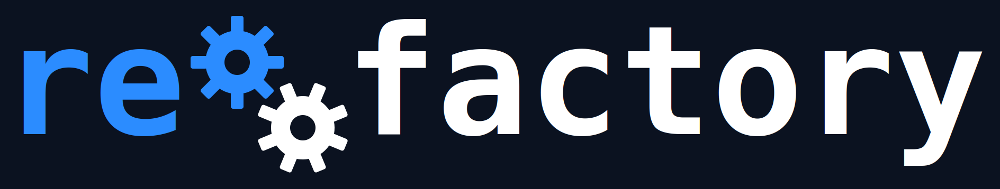

<p align="center">
  
</p>


[](https://github.com/akashgit/remote-factory/actions/workflows/ci.yml)
[](https://codecov.io/gh/akashgit/remote-factory)
[](https://www.python.org/downloads/)
[](LICENSE)
[](https://docs.anthropic.com/en/docs/claude-code)
[](https://bob.ibm.com)
[](https://openai.com/index/codex/)

**Describe what you want — re:factory builds it, tests it, and keeps improving it.** Design an idea from scratch or point at an existing project for continuous improvement. Runs with [Claude Code](https://docs.anthropic.com/en/docs/claude-code), [Bob Shell](https://bob.ibm.com), and [OpenAI Codex](https://openai.com/index/codex/).

All state is local — per-project in `.factory/` (add to `.gitignore`), global in `~/.factory/`. See [Architecture](docs/architecture.md) for the full deep-dive.

---

## Quick Start

**Prerequisites:** Python 3.11+, [uv](https://docs.astral.sh/uv/), and [Claude Code](https://docs.anthropic.com/en/docs/claude-code) (installed and authenticated).

```bash
git clone https://github.com/akashgit/remote-factory.git
cd remote-factory
uv sync
```

Then start with one of the two main workflows:

```bash
# Design — brainstorm an idea, refine it, then build
uv run factory ceo "my idea" --mode design

# Improve — point at an existing project for continuous improvement
uv run factory ceo /path/to/project --mode improve --focus "issue # or whatever you want to improve or fix"

# Co-improve — if you want to iterate on the implementation plan before implementation starts for an improvement
uv run factory ceo /path/to/project --mode design --focus "issue # or whatever you want to improve or fix"
```

See the [full setup guide](docs/setup.md) for authentication and environment variables.

---

## What Do You Want to Do?

| I want to… | Command |
|---|---|
| **Start from a raw idea** | `uv run factory ceo "my idea" --mode design` |
| **Improve an existing project** | `uv run factory ceo /path/to/project --mode improve --focus "issue number or whatever you want to improve or fix ` |
| **Co-improve an existing project** | `uv run factory ceo /path/to/project --mode design --focus "description of whatever you want to improve or fix ` |
| **Create a new factory mode** | `uv run factory ceo /path/to/factory --mode create "description"` |

---

## Design Workflow

Use design mode when you want to brainstorm before building. Start a conversation with the CEO to refine an idea, then build:

```bash
# From a raw idea — discuss and refine into a buildable spec
uv run factory ceo "distributed task runner" --mode design

# From a spec file — read and discuss before building
uv run factory ceo ~/ideas/my-app-spec.md --mode design
```

Design mode also works on existing projects. The CEO studies the backlog, eval scores, open issues, and experiment history, then discusses what to work on before executing:

```bash
uv run factory ceo ~/factory-projects/my-app --mode design

# Seed the conversation with a topic
uv run factory ceo ~/factory-projects/my-app --mode design --focus "auth layer"
```

You can also pass a spec file or URL directly — `uv run factory ceo spec.md` — and re:factory builds without the design conversation.

---

## Improve Workflow

Improve mode is re:factory's continuous improvement loop for existing projects. Point it at a codebase and it autonomously observes the project state, generates hypotheses for improvements, builds and tests changes, and keeps or reverts each experiment based on eval scores.

```bash
uv run factory ceo ~/factory-projects/my-app --mode improve
```

Each cycle: **observe** → **hypothesize** → **build** → **review** → **measure** → **decide** (keep or revert) → **archive**. The Strategist picks work from the backlog using FEEC priority (Fix > Exploit > Explore > Combine).

When you know exactly what you want, `--focus` pins a single target — one hypothesis, one experiment, done:

```bash
uv run factory ceo ~/my-app --mode improve --focus "add dark mode toggle"
uv run factory ceo ~/my-app --mode improve --focus 42                       # GitHub issue
uv run factory ceo ~/my-app --mode improve --focus "owner/repo#42"          # Issue shorthand
```

---

## Post-Cycle Refinement

After a build or improve cycle finishes in foreground mode, the CEO stays active — it doesn't exit. Ask for changes directly:

> "Fix the typo in the header"
> "Add error handling to the upload endpoint"
> "Make the tests more thorough"

Each request runs through the full experiment pipeline: the **Refiner** scopes it → **Builder** implements → review + eval + E2E gate → keep/revert verdict. No shortcuts — every refinement is a tracked experiment with its own PR.

You can also invoke refinements directly with `--refine`:

```bash
uv run factory ceo ~/my-app --refine "add rate limiting to the API"
```

There's no cap on refinements. Advisory warnings appear at 5 and 10 to flag context growth, but the user decides when to stop.

---

## Create New Modes

Create mode lets you build new factory modes — new workflows, new pipelines, new factories — from a description. Describe what the mode should do, and re:factory researches existing patterns, synthesizes a workflow spec, gets your approval, then implements everything: workflow definition, SKILL.md, CLI wiring, and tests.

```bash
# From a description
uv run factory ceo /path/to/factory --mode create "a mode that audits security vulnerabilities"

# From a spec file
uv run factory ceo /path/to/factory --mode create ~/specs/audit-mode.md
```

The pipeline: **3 parallel researchers** (existing patterns, intent analysis, best practices) → **Strategist** synthesizes a workflow spec → **you approve** (like design mode) → **Builder** implements → **QA** verifies end-to-end → **PR**.

Create mode is interactive — it requires your approval at the strategy gate before building. Point it at the factory repo itself to extend re:factory with custom pipelines.

---

## Eval System

Every change is measured by an 11-dimension composite score across three tiers: **Hygiene** (tests, lint, types, coverage), **Growth** (API surface, experiment diversity, observability), and **Project** (user-defined domain metrics). On first run, `uv run factory discover` auto-detects your project's language and framework to generate the eval profile. See [Eval System](docs/eval.md) for scoring details, weights, and guards.

---

## Built with re:factory

| Project | What it does | Mode |
|---------|-------------|------|
| **SWE-bench solver** | Autonomous agent that resolves GitHub issues, improved via failure analysis | Research |
| **HMMT math solver** | Multi-agent team that solved HMMT Feb 2025 Combinatorics Problem 7 | Research |
| **Text/Sketch → CAD** | Natural language and sketches to executable CadQuery Python code for 3D models | Research |
| **HLS design space explorer** | Per-function AI agents + ILP solver for HLS optimization — 92% execution time reduction | Build |
| **Pluck** | iOS app that extracts structured data from screenshots using on-device AI | Build + Improve |
| **[SDG Hub](https://github.com/Red-Hat-AI-Innovation-Team/sdg_hub)** | Agent-maintained open-source framework for synthetic data generation | Build + Improve |
| **[OpenSkies Airline Corpus](https://github.com/lukeinglis/OpenSkiesAirline)** | 85-document fictional airline corpus for RAG/fine-tuning evaluation with cross-document consistency validation | Design + Improve |
| **re:factory itself** | Runs on itself — continuously improved via its own experiment outcomes | Meta |

Built something with re:factory? Open a PR to add it here.

---

## CLI Quick Reference

```bash
# Core workflow
uv run factory ceo "idea" --mode design         # Design from a raw idea
uv run factory ceo <path> --mode improve        # Improve an existing project
uv run factory ceo <path> --refine "..."        # Single targeted refinement
uv run factory ceo <path> --mode create "..."  # Create a new factory mode
uv run factory ceo <path> --loop                # Continuous improvement loop
uv run factory tmux <path> --loop               # Loop in detached tmux session
```

See `uv run factory --help` for the complete list.

---

## Runners

re:factory supports multiple CLI backends. Default is Claude Code — switch with `--runner` or `FACTORY_RUNNER`:

```bash
# Direct
CODEX_API_KEY="..." uv run factory ceo /path --runner codex
BOBSHELL_API_KEY="..." uv run factory ceo /path --runner bob

# Via config.toml profile (persistent)
uv run factory ceo /path --profile codex
```

Configure profiles in `~/.factory/config.toml`:

```toml
[credentials.codex]
FACTORY_RUNNER = "codex"
CODEX_API_KEY = "..."

[credentials.bob]
FACTORY_RUNNER = "bob"
BOBSHELL_API_KEY = "..."
```

Run `uv run factory config show` to see resolved config, or `uv run factory config edit` to open the file. See [Setup Guide](docs/setup.md) for full details.

---

## LLM Tracing (LangFuse)

LangFuse provides LLM observability and tracing — track agent invocations, token usage, and execution flow across all factory runs.

### Quick Start

```bash
# Start LangFuse services
scripts/langfuse-setup start

# Set the env vars the factory needs
export LANGFUSE_HOST=http://localhost:3000
export LANGFUSE_BASE_URL=http://localhost:3000
export LANGFUSE_PUBLIC_KEY=pk-lf-dev-local-key
export LANGFUSE_SECRET_KEY=sk-lf-dev-local-key
export TELEMETRY_PLATFORM=langfuse
```

The dev credentials above match the docker-compose setup. Add them to your `~/.bashrc` or `~/.zshrc` to persist across sessions.

### Viewing Traces

1. Start LangFuse: `scripts/langfuse-setup start`
2. Run the factory: `uv run factory ceo /path/to/project`
3. Open `http://localhost:3000` in your browser
4. Login: `dev@localhost.local` / `devpassword123`

### CLI Commands

```bash
scripts/langfuse-setup start    # Start LangFuse services
scripts/langfuse-setup stop     # Stop services
scripts/langfuse-setup status   # Show status and credentials
```

### Requirements

- **Docker** or **Podman** — any of `docker compose`, `docker-compose`, or `podman-compose` works

### Disabling Tracing

To disable tracing without stopping LangFuse:
```bash
export LANGFUSE_TRACING_ENABLED=false
```

For LLM connection setup, trace structure details, and troubleshooting, see [`infra/langfuse/README.md`](infra/langfuse/README.md).

---

## Install as a Claude Code Plugin

re:factory is also distributed as a fully-bundled [Claude Code plugin](https://docs.claude.com/en/docs/claude-code/plugins) — agents, skills, and slash commands packaged together. A GitHub Actions workflow rebuilds the `plugins` branch of this repo on every push to `main`, so it always tracks the latest generated artifacts.

From inside Claude Code:

```text
/plugin marketplace add akashgit/remote-factory#plugins
/plugin install factory@remote-factory
/reload-plugins
```

Once installed, the plugin exposes:

- The `/factory:implement` slash command (entry point for the multi-agent pipeline).
- Namespaced subagents — invoke with `factory:ceo`, `factory:researcher`, `factory:builder`, etc.
- The bundled skills under `.agents/skills/` (e.g. `pipeline-subagents`, `implement`).

The plugin still shells out to the `factory` CLI for the heavy lifting, so you'll need `uv` and the `factory` package installed locally as described in [Quick Start](#quick-start).

To update later: `/plugin marketplace update remote-factory`. To remove: `/plugin uninstall factory@remote-factory`.

---

## Plugin Agents

If you'd rather skip the marketplace and just register the specialist agents as standalone Claude Code (or Codex) subagents, use the built-in installer:

```bash
uv run factory install                   # Install all 9 agents to ~/.claude/agents/
uv run factory install --runner codex    # Or install Codex TOML agents to ~/.codex/agents/
claude --agent factory-ceo "improve this project"
claude --agent factory-researcher "study the auth system"
```

This path only ships the agent prompts (no skills, no slash commands) and is independent of the plugin marketplace install above.

---

## Documentation

| Doc | What's in it |
|-----|-------------|
| [Setup Guide](docs/setup.md) | Installation, authentication, environment variables |
| [Getting Started](docs/getting-started.md) | Lifecycle walkthrough, research mode details, factory.md config |
| [Architecture](docs/architecture.md) | Three-layer system, agent roles, state machine, data flow |
| [Eval System](docs/eval.md) | Hygiene/growth/project tiers, scoring, guards, precheck |
| [Configuration](docs/configuration.md) | `factory.md` reference — all sections and options |
| [ACE Self-Improvement](docs/ace.md) | How re:factory evolves its own agent playbooks |
| [Contributing](docs/contributing.md) | Dev setup, code style, testing, PR workflow |

## Development

```bash
uv sync --all-groups              # Install all deps including dev
uv run pytest -v                  # Full test suite
uv run ruff check .               # Lint
uv run mypy factory/              # Type check
```

## License

[MIT](LICENSE) — Akash Srivastava
