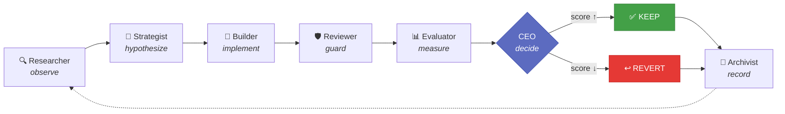
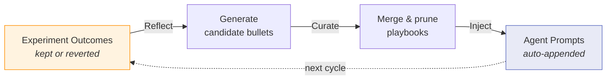
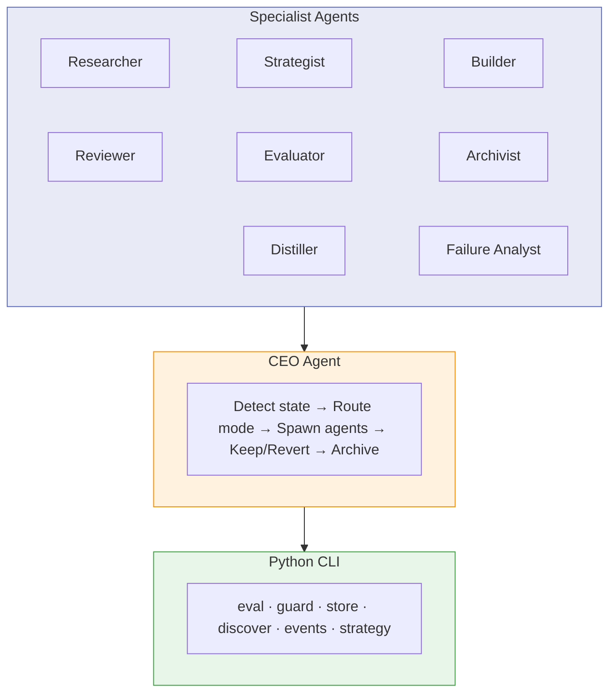
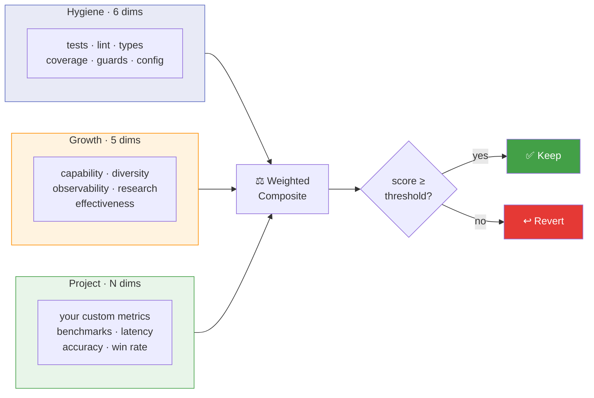

---
hide:
  - navigation
---

# The Factory

**Describe what you want. The Factory builds it, tests it, and keeps improving it — autonomously.**

You give it a spec file, a rough idea, or an existing codebase. The Factory researches best practices, scaffolds the project, sets up evaluation, and runs a continuous improvement loop — measuring every change and keeping only what makes things better. The agents that do this work learn from every experiment and get sharper over time.

```bash
# Build — have a fleshed-out idea? Pass the file.
factory ceo ~/ideas/weather-dashboard.md

# Interactive — just starting to think about it? Brainstorm first.
factory ceo "distributed eval runner" --mode interactive

# Research — have a metric to optimize? The factory runs experiments.
factory ceo "SWE-bench solver agent" --mode research

# Improve — point it at any codebase
factory ceo ~/my-project

# Focus — build exactly one thing
factory ceo ~/my-project --focus "add WebSocket support"
```

## How It Works



A CEO agent orchestrates eight specialists — Researcher, Strategist, Builder, Reviewer, Evaluator, Archivist, Distiller, and Failure Analyst — each running as an independent [Claude Code](https://docs.anthropic.com/en/docs/claude-code) subprocess. The Researcher searches the web and reads prior knowledge from the archive. The Strategist generates ranked hypotheses. The Builder implements one on an experiment branch. The Evaluator scores before and after. The CEO decides keep or revert. The Archivist records everything to `.factory/archive/` and regenerates performance reports for cross-project learning. In interactive mode, the Distiller synthesizes research into a buildable spec through user feedback. In research mode, the Failure Analyst classifies run failures to guide targeted hypothesis generation.

## Workflows

### Build — start from an idea

```bash
factory ceo "Build a REST API for bookmark management"
factory ceo ~/ideas/weather-dashboard.md
factory ceo https://github.com/user/repo
```

Give the Factory an idea (raw string, spec file, or GitHub URL) and it builds a complete project: scaffolding, tests, eval, and iterative improvement.

### Improve — make an existing codebase better

```bash
factory ceo ~/my-project
factory run ~/my-project --loop
```

Point it at any codebase. Each cycle observes the project, hypothesizes changes, implements one, and keeps it only if the score goes up.

### Focus — build exactly one thing

```bash
factory ceo ~/my-project --focus "add authentication middleware"
```

When you know exactly what you want, `--focus` pins a single backlog item, generates one hypothesis, runs one experiment, and exits. The entire pipeline is scoped to that single target.

### Interactive — brainstorm before building

```bash
factory ceo "distributed eval runner" --mode interactive
```

Have a rough idea? Interactive mode researches the space, drafts a structured spec via the Distiller agent, and lets you iterate on it before any code is written.

### Research — optimize a metric iteratively

```bash
factory ceo "SWE-bench solver agent" --mode research
factory ceo ~/my-research-project --mode research
```

For projects with a measurable target metric (benchmark accuracy, solve rate, query precision). Research mode replaces the standard Improve loop with a specialized cycle: Baseline → Failure Analyst → Researcher → Strategist → Builder → Run → Verdict. Leakage guards prevent ground truth from contaminating hypotheses, and monotonic improvement ensures the metric never regresses below the previous best. See [Getting Started](getting-started.md#research-mode-in-detail) for the full picture.

### Headless & continuous loop

For unattended operation — scripting, cron jobs, or always-on machines:

```bash
# Headless — pipe mode, no interaction
factory ceo ~/my-project --headless

# Loop — continuous improvement (default: every 30 min)
factory run ~/my-project --loop

# Detached tmux — loop in the background
factory tmux ~/my-project --loop
```

`--headless` disables the interactive session. `--loop` wraps the CEO in a heartbeat loop: run one cycle, sleep, repeat. Combine with `factory tmux` to leave the Factory running on an always-on machine. See [Getting Started](getting-started.md) for full details.

## Quick Start

```bash
# Install from source (recommended — the factory evolves fast)
git clone https://github.com/akashgit/remote-factory.git
cd remote-factory && uv sync && uv tool install -e .

# Register the CEO as a Claude Code agent
factory install
```

**Prerequisites:** Python 3.11+ and [Claude Code](https://docs.anthropic.com/en/docs/claude-code) (installed and authenticated). No external services, databases, or Obsidian required — the factory stores all state locally.

Per-project state lives in `.factory/` (experiment history, strategy, archive notes). Global state lives in `~/.factory/` (project registry, evolved playbooks). Projects are auto-registered when experiments begin — no manual setup needed. See [Setup Guide](setup.md) for environment variables and authentication options.

## Self-Evolving Agents

The factory doesn't just improve your project — it improves *itself*. Every keep/revert decision becomes training data for the next cycle.

This is powered by **ACE (Autonomous Context Engineering)** — inspired by Anthropic's work on [context engineering](https://www.anthropic.com/engineering/effective-context-engineering-for-ai-agents) — a Reflect → Curate → Inject loop that evolves agent playbooks from real experiment outcomes.



Each agent accumulates behavioral rules — DOs and DON'Ts — with evidence counters. Rules that correlate with kept experiments get reinforced. Rules that correlate with reverts get pruned.

```bash
# Run a full improvement cycle, then evolve all agent playbooks
factory ceo ~/my-project --mode meta
```

See [Self-Improvement Loop](self-improvement.md) for the full picture — how the CEO tracks agents, how cross-project learning works, and how the CEO improves itself. See [ACE Playbook Evolution](ace.md) for the playbook mechanics.

## Architecture



## The Eval System



| Tier | What it measures | Examples |
|------|-----------------|---------|
| **Hygiene** (6 dimensions) | Code quality basics | Tests, lint, type checking, coverage |
| **Growth** (5 dimensions) | Capability evolution | API surface area, experiment diversity, observability |
| **Project** (user-defined) | Domain-specific metrics | Benchmark accuracy, latency, win rate |

## Built with the Factory

The factory has shipped something every day for the last 30 days — products, research experiments, production features, papers. Here are a few examples:

| Project | What it does | Mode |
|---------|-------------|------|
| **SWE-bench solver** | Autonomous agent that resolves GitHub issues from the SWE-bench dataset, iteratively improved via failure analysis | Research |
| **HMMT math solver** | Multi-agent team (Explorer, Theorist, Computationalist, Critic, Synthesizer) that solved HMMT Feb 2025 Combinatorics Problem 7 | Research |
| **Text/Sketch → CAD** | Converts natural language and hand-drawn sketches into executable CadQuery code for 3D model generation | Research |
| **HLS design space explorer** | Per-function AI agents explore HLS pragma/code variants in parallel, an ILP solver finds the optimal combination, then global expert agents apply cross-function optimizations — achieving up to 92% execution time reduction on cryptographic benchmarks | Build |
| **Pluck** | iOS app that extracts structured data from screenshots, links, and shared content using on-device AI | Build + Improve |
| **Group chat digest** | Turns iMessage group chats into weekly family newsletters with AI-curated highlights and photo selection | Build + Improve |
| **Production enterprise features** | Complete UI components and backend features shipped into a large-scale production codebase | Focus + Improve |
| **The Factory itself** | The factory runs on itself in meta mode — its own agent playbooks are evolved from its own experiment outcomes | Meta |

Built something with the Factory? [Open a PR](https://github.com/akashgit/remote-factory/pulls) to add it here.

## License

[MIT](https://github.com/akashgit/remote-factory/blob/main/LICENSE) — Akash Srivastava
