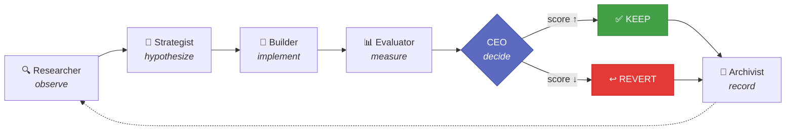
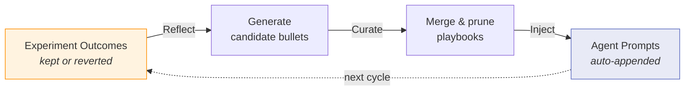
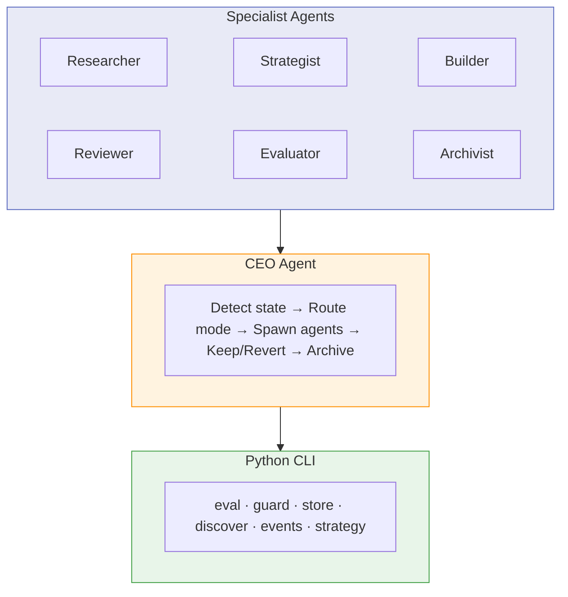
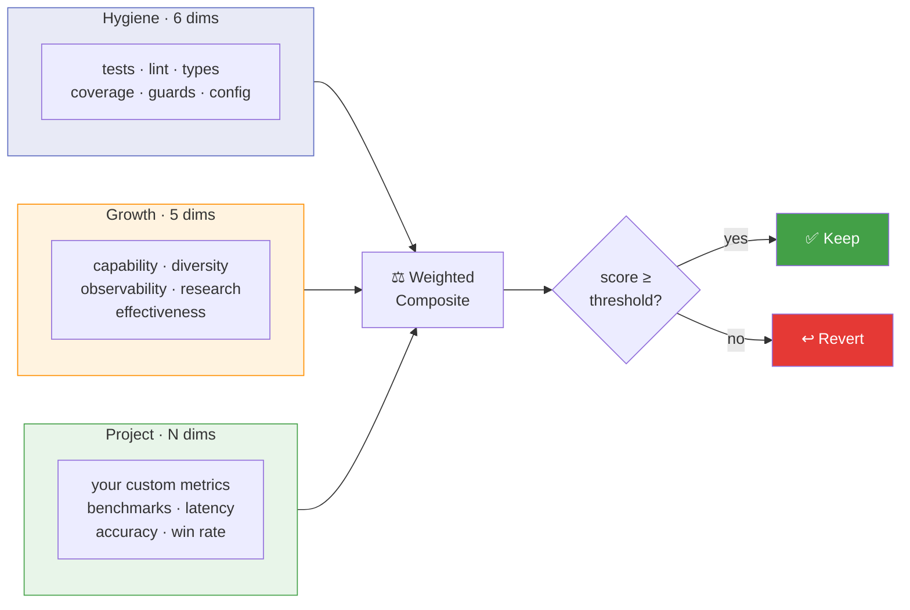

---
hide:
  - navigation
---

# The Factory

**Describe what you want. The Factory builds it, tests it, and keeps improving it — autonomously.**

You can hand it a one-line prompt, a detailed spec, a path to an idea file, or an existing codebase. The Factory researches best practices, scaffolds the project, sets up evaluation, and then runs a continuous improvement loop — measuring every change and keeping only what makes things better. The agents that do this work learn from every experiment and get sharper over time.

```bash
# Got an idea? Describe it.
factory ceo --prompt "Build a CLI that converts CSV to JSON with streaming support"

# Have an idea written up in a file? Pass the path.
factory ceo ~/ideas/weather-dashboard.md  # reads the file as the build spec

# Already have a repo? Point the factory at it.
factory ceo ~/my-project
```

## How It Works



A CEO agent orchestrates six specialists — each running as an independent [Claude Code](https://docs.anthropic.com/en/docs/claude-code) subprocess. The Researcher searches the web and reads vault knowledge. The Strategist generates ranked hypotheses. The Builder implements one on an experiment branch. The Evaluator scores before and after. The CEO decides keep or revert. The Archivist records everything for cross-project learning.

## What Can It Do?

**Build from nothing** — give it an idea, it does the rest:

| Input | What happens |
|-------|-------------|
| `factory ceo --prompt "Build a weather CLI"` | Researches best practices, scaffolds the project, sets up tests and eval, then improves it |
| `factory ceo ~/ideas/my-idea.md` | Reads the file as the build spec and builds the project end-to-end |
| `factory ceo https://github.com/user/repo` | Clones the repo, discovers what it does, sets up evaluation, then starts improving |

**Improve what exists** — point it at any codebase:

| Input | What happens |
|-------|-------------|
| `factory ceo ~/my-project` | Discovers eval dimensions, then runs measured improvement cycles |
| `factory ceo ~/my-project --focus "auth"` | Narrows all hypotheses to a specific area |
| `factory run ~/my-project --loop` | Continuous background improvement — runs every 30 min |

## Quick Start

```bash
# Install from source (recommended — the factory evolves fast)
git clone https://github.com/akashgit/remote-factory.git
cd remote-factory && uv sync && uv tool install -e .

# Register the CEO as a Claude Code agent
factory install

# Set up the Obsidian vault (highly recommended)
export FACTORY_VAULT_PATH=~/factory-vault
factory vault-init
```

**Prerequisites:** Python 3.11+ and [Claude Code](https://docs.anthropic.com/en/docs/claude-code) (installed and authenticated).

**Why Obsidian?** The vault is the factory's long-term memory. If you use Claude to brainstorm ideas and save them as vault notes, the factory can build directly from those notes — just reference them by name. Without a vault, the factory still works but starts fresh every time.

## Self-Evolving Agents

The factory doesn't just improve your project — it improves *itself*. Every keep/revert decision becomes training data for the next cycle.

This is powered by **ACE (Autonomous Context Engineering)** — inspired by Anthropic's work on [context engineering](https://www.anthropic.com/engineering/effective-context-engineering-for-ai-agents) — a Reflect → Curate → Inject loop that evolves agent playbooks from real experiment outcomes.



Each agent accumulates behavioral rules — DOs and DON'Ts — with evidence counters. Rules that correlate with kept experiments get reinforced. Rules that correlate with reverts get pruned.

```bash
# Run a full improvement cycle, then evolve all agent playbooks
factory ceo ~/my-project --mode meta
```

See [Self-Improvement Loop](self-improvement.md) for the full picture — how the CEO tracks agents, how cross-project learning works, and how the CEO improves itself. See [ACE Playbook Evolution](ace.md) for the playbook mechanics.

## Architecture



## The Eval System



| Tier | What it measures | Examples |
|------|-----------------|---------|
| **Hygiene** (6 dimensions) | Code quality basics | Tests, lint, type checking, coverage |
| **Growth** (5 dimensions) | Capability evolution | API surface area, experiment diversity, observability |
| **Project** (user-defined) | Domain-specific metrics | Benchmark accuracy, latency, win rate |

## License

[MIT](https://github.com/akashgit/remote-factory/blob/main/LICENSE) — Akash Srivastava
