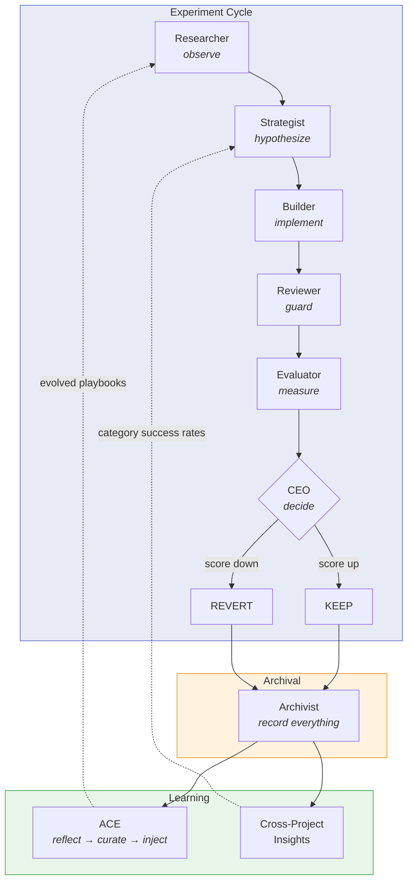

# Self-Improvement Loop

re:factory is a fully autonomous self-improvement system. Once pointed at a project, it runs measured experiments, learns from the outcomes, and gets sharper over time — no human intervention required. This document explains how the loop works end-to-end: how the CEO tracks agents, how playbooks evolve, how cross-project learning feeds back, and how the CEO improves itself.

## The Loop at a Glance



Every experiment produces structured data: hypothesis category, verdict (keep/revert), score delta, and CEO decision metadata. This data feeds two learning systems — ACE (playbook evolution) and cross-project insights (category success rates) — which shape the next cycle's behavior.

## How the CEO Tracks Agents

Every specialist agent runs as an independent Claude Code subprocess. The CEO doesn't just spawn and forget — it enforces a **mandatory review gate** after each agent completes.

### The Review Gate

1. Agent runs and produces output
2. Output is auto-saved to `.factory/reviews/<role>-latest.md`
3. CEO reads the output and writes a verdict to `.factory/reviews/ceo-verdict-<role>.md`:

```markdown
## Verdict: PROCEED | REDIRECT | ABORT

**Rationale:** [specific evidence from agent output]
**Issues found:** [list]
**Instructions for next agent:** [what to pass forward]
```

| Verdict | What happens |
|---------|-------------|
| **PROCEED** | Move to the next agent in the pipeline |
| **REDIRECT** | Re-invoke the same agent with corrections (max 2 retries) |
| **ABORT** | Log failure, skip to recovery |

### Role-Specific Assessment

The CEO evaluates each agent against criteria tailored to its role:

| Agent | What the CEO checks |
|-------|-------------------|
| **Researcher** | Covered the right topics? Enough depth? Web research included? |
| **Strategist** | Hypotheses align with goals? At least one growth hypothesis? (**hard gate**) |
| **Builder** | PR matches plan? No scope creep? Tests included? |
| **Reviewer** | Substantive review? Violations caught? Not rubber-stamped? |
| **Evaluator** | Valid JSON scores? All dimensions present? Before/after compared? |

The Strategist gate is particularly important: if all hypotheses target hygiene dimensions (lint, tests, types) with none targeting growth (capability, diversity, observability), the CEO redirects with an explicit correction. This prevents the system from grinding on polish while ignoring real improvements.

### Decision Metadata

Every keep/revert decision is recorded with structured metadata in the experiment notes:

```
ceo:keep score_delta=+0.05 precheck=passed agents_spawned=R,S,B,RV,E,A
ceo:revert reason=precheck_failed failures=score_direction score_delta=-0.02
```

This metadata is later parsed by the ACE reflector to learn from the CEO's own decisions.

### Mandatory Archival

The Archivist runs after every phase — not just at the end. The CEO tracks archival completion via checkpoint files:

```
Researcher → ARCHIVIST → Strategist → ARCHIVIST → Builder → ARCHIVIST
→ Reviewer → ARCHIVIST → Evaluator → ARCHIVIST → Final ARCHIVIST (blocking)
```

The final Archivist invocation is blocking: the CEO waits for it to complete before finalizing. If any checkpoint is missing, the CEO spawns the Archivist for that phase before continuing. This is Sacred Rule 7 — the system's most battle-tested behavioral rule (`helpful=28, harmful=4`).

## ACE: How Playbooks Evolve

ACE (Autonomous Context Engineering) is a three-phase loop that turns experiment outcomes into behavioral rules for agents. See [ACE Self-Improvement](ace.md) for the mechanics. Here's how it fits into the larger system.

### What Feeds ACE

ACE draws from two data sources per project:

**Primary: Performance reports** (`.factory/performance_report.json`) — consolidated data including experiment records, CEO verdict patterns (PROCEED/REDIRECT/ABORT counts per role), and observation coverage (how much of the archive is populated). Generated by `factory report-update`.

**Fallback: TSV history** (`results.tsv`) — raw experiment records with hypothesis text, verdict, score delta, and CEO decision notes.

Each experiment record contains:
- The hypothesis text (classified into one of 13 categories: bugfix, testing, feature, refactoring, etc.)
- The verdict (keep, revert, or error)
- The score delta (how much the composite score changed)
- CEO decision notes (structured metadata about what agents were spawned, what failed)

ACE analyzes this across **all re:factory-managed projects** (discovered via the global registry) — not just the current one.

### What ACE Produces

For each of the agent roles, ACE generates DO and DON'T rules backed by empirical evidence:

```markdown
### DO
- [strat-00003] helpful=8 harmful=1 :: Prioritize testing hypotheses — 85% keep rate across 12 experiments

### DON'T
- [strat-00005] helpful=5 harmful=0 :: Avoid pure refactoring hypotheses — only 30% keep rate, high revert risk
```

In addition to experiment-outcome bullets, the reflector generates two new types of bullets from performance reports:

- **Verdict pattern bullets** — when a specific agent role accumulates 3+ REDIRECTs or 2+ ABORTs, a bullet flags the pattern (e.g., "The builder agent frequently needs REDIRECT (4 times)")
- **Observation coverage bullets** — when archive notes are sparse relative to total observations, a bullet recommends more thorough documentation

Each rule has `helpful` and `harmful` counters. Rules that correlate with reverted experiments accumulate harmful counts. Once `harmful > helpful` with 3+ observations, the rule gets pruned. The playbook is capped at 15 items to prevent prompt bloat.

### How Rules Reach Agents

At invocation time, `factory/agents/runner.py` does a two-step prompt assembly:

1. Load the base prompt (`factory/agents/prompts/<role>.md` or project override)
2. Load the evolved playbook (`~/.factory/playbooks/<role>.md`, falling back to `factory/agents/playbooks/<role>.md`) and append it as a `## Behavioral Playbook` section

The agent sees its evolved rules as part of its instructions. No explicit "follow these rules" preamble needed — they're integrated into the prompt.

## Cross-Project Learning

This is where re:factory's knowledge compounds. Instead of treating each project as isolated, re:factory learns patterns that transfer across projects.

### How Insights Are Generated

`factory/insights.py` discovers all re:factory-managed projects (via the global registry, with directory scanning as fallback), loads their experiment histories, and computes:

- **Category success rates**: Which types of hypotheses (bugfix, testing, feature, observability, etc.) get kept vs reverted across all projects
- **Winning categories**: Keep rate >= 80% with 3+ experiments (reliable bets)
- **Losing categories**: Keep rate < 50% with 3+ experiments (risky bets)
- **Cross-project patterns**: Categories that are reliable across multiple projects (>90% keep rate) or risky across projects (<50% keep rate)

The output is a `CrossProjectInsights` object with evidence-backed patterns and confidence scores.

### How Insights Are Used

Cross-project insights flow into the system at three points:

**1. Researcher observations** — When the Researcher agent runs in Meta mode (improving re:factory itself), it reads `.factory/strategy/insights.md` and uses category success rates to inform what areas to investigate.

**2. Strategist hypothesis ranking** — The FEEC priority system (Fix > Exploit > Explore > Combine) uses category success rates to rank hypotheses. A hypothesis in a winning category gets a boost; one in a losing category gets deprioritized.

**3. ACE reflection** — The reflector generates playbook bullets from cross-project data. If `testing` hypotheses have an 85% keep rate across 5 projects, the Strategist gets a DO bullet recommending testing hypotheses. If `refactoring` has a 30% keep rate, it gets a DON'T.

### Archive and Performance Reports

The Archivist writes structured notes to `.factory/archive/` inside each project:

```
.factory/archive/
├── experiments/                 # Per-experiment notes
│   └── {project}-NNN.md
├── strategies/                  # Strategy snapshots
│   └── {project}-{date}.md
├── sources/                     # Research source notes
│   └── {source-name}.md
├── patterns/                    # Cross-project patterns
│   └── patterns.md
└── {project}.md                 # Project dashboard
```

After writing notes, the Archivist runs `factory report-update` to regenerate `.factory/performance_report.json` — a consolidated report that merges experiment records, CEO verdicts, and observations into a single file. This report is what the ACE reflector reads for qualitative signals (verdict patterns, observation coverage).

The Researcher reads prior knowledge from `.factory/archive/sources/` before doing web searches — if a topic is already covered by source notes, it skips the web search and uses the archived knowledge. This means re:factory gets faster and more targeted as its archive grows.

### Global Project Registry

re:factory maintains a global registry at `~/.factory/registry.json` that tracks all re:factory-managed projects. Projects are auto-registered when experiments begin (`factory begin`) and stats are updated on finalize. This replaces the previous approach of scanning a `--projects-dir` directory.

The registry enables:
- **ACE without `--projects-dir`**: The reflector discovers projects via the registry, falling back to directory scanning for backward compatibility
- **Cross-project insights**: `factory insights` and `factory study` use the registry to find projects automatically
- **Dashboard**: The live dashboard reads from the registry to list all managed projects

## How the CEO Improves Itself

The CEO's own playbook evolves through the same ACE pipeline as every other agent. There's no special case — the CEO is treated as another role with its own behavioral rules.

### What the Reflector Analyzes for the CEO

The ACE reflector parses `ceo:keep` and `ceo:revert` notes from experiment history and generates CEO-specific bullets by analyzing:

- **Overall keep/revert rate**: If keep rate is below 30%, hypotheses are too ambitious — bullet: "scope down." If above 80%, they're too conservative — bullet: "be bolder."
- **Builder failure patterns**: If the Builder consistently fails on certain types of changes, the CEO learns to redirect earlier.
- **Reviewer strictness**: If experiments are reverted despite positive score deltas (Reviewer caught something the score missed), the CEO learns to trust the Reviewer.
- **Archival compliance**: Tracks whether archival checkpoints were skipped — generates enforcement bullets.
- **Decision accuracy over time**: Were keeps actually beneficial? Were reverts wise in retrospect?

### Current CEO Playbook (as of writing)

The CEO's playbook contains 10 empirically evolved rules, including:

| Rule | Evidence |
|------|----------|
| E2E testing before optimization | `helpful=1` |
| Real E2E tests after integration code | `helpful=1` |
| ALWAYS spawn Archivist | Enforced rule |
| Hard-reject all-hygiene hypothesis sets | `helpful=0` |
| Mandatory Playwright verification for UI focus | `helpful=0` |
| Archival at every checkpoint | `helpful=28, harmful=4` |

The last rule — archival at every checkpoint — is the most battle-tested rule in the system. It was reinforced by 28 experiments and only contradicted by 4, making it the strongest empirical signal the CEO operates on.

### The Feedback Loop

```
CEO makes keep/revert decisions
    → structured notes in results.tsv (ceo:keep score_delta=+0.05 ...)
    → ACE reflector parses CEO notes
    → generates CEO-specific bullets
    → curator merges with existing CEO playbook
    → next CEO invocation gets updated playbook
    → CEO makes better decisions
    → loop continues
```

## Meta Mode: Full Self-Improvement

Meta mode (`factory ceo --mode meta`) is re:factory improving itself. It runs in two phases:

### Phase 1: Improve re:factory

The CEO runs the full experiment loop on re:factory's own codebase:

1. Researcher observes re:factory code + reads cross-project insights
2. Strategist generates hypotheses for improving re:factory (e.g., "add stuck detection to FEEC," "improve eval reliability")
3. Builder implements on an experiment branch
4. Evaluator scores before and after
5. CEO decides keep or revert
6. Archivist records everything

This is re:factory eating its own dogfood — the same process it uses on target projects, applied to itself.

### Phase 2: Evolve All Playbooks

After the improve cycle, the CEO runs ACE across all managed projects:

1. **Update counters**: Load all experiment records, update `helpful`/`harmful` counters on existing playbook bullets
2. **Reflect**: Analyze cross-project experiment data, generate candidate bullets for all agent roles
3. **Curate**: Merge candidates with existing playbooks, deduplicate (75% similarity threshold), prune net-negative rules, cap at 15 items per role

```bash
# Run meta mode
factory ceo ~/remote-factory --mode meta

# Or run ACE independently
factory ace ~/remote-factory
```

### When to Run Meta Mode

Meta mode is re:factory's most powerful self-improvement mechanism, but it has diminishing returns if run too frequently or too early. ACE needs a critical mass of experiment data to generate meaningful playbook updates. Running it too early produces noisy rules from small samples; running it too often churns playbooks without enough new evidence between runs.

**Recommended cadence:**

| Usage level | Cadence | Rationale |
|-------------|---------|-----------|
| Light (1-2 experiments/day) | Weekly | One week accumulates enough new outcomes for ACE to find real patterns |
| Heavy (5+ experiments/day) | Nightly | High experiment volume means new signal accumulates faster |
| Occasional (a few experiments/week) | Every two weeks or on-demand | Not enough data to justify frequent evolution |

**Prerequisites — run meta mode only when:**
- At least **5 experiments** have been recorded across your managed projects since the last meta run (10+ preferred for stronger signal). ACE analyzes cross-project data; with fewer than 5 experiments, it lacks the sample size to distinguish signal from noise.
- re:factory has been through at least one full Build-Discover-Improve cycle on at least one project. Running meta mode on a brand-new factory with no experiment history is a no-op.

**Signs it's time to run meta mode:**
- **Stale playbooks**: Agents keep making the same mistakes that get reverted — the playbooks haven't learned to avoid those patterns yet.
- **Consistent revert patterns**: You see 3+ reverts in the same category across projects, but the Strategist keeps proposing that category.
- **New project types**: You started managing a project in a language or domain re:factory hasn't seen before. Meta mode can generate domain-specific playbook rules from the new experiment data.
- **Playbook counters are outdated**: Check `~/.factory/playbooks/*.md` — if the `helpful`/`harmful` counters are far behind the actual experiment count in `results.tsv`, ACE needs to catch up.

**When NOT to run meta mode:**
- **Right after initial build.** re:factory just scaffolded a project and has zero or one experiment. ACE has nothing to learn from yet. Wait until the project has been through several improve cycles.
- **After every improve loop.** This is the most common mistake. Each improve cycle produces 1-5 experiments — not enough new data to meaningfully change playbooks. The result is noisy churn: rules get added and removed in rapid succession without converging.
- **When the last meta run was recent and few new experiments have run.** If you ran meta mode yesterday and only 2 new experiments have completed since, skip it.
- **During a focused improvement sprint.** If you're using `--focus` to target a specific area, finish the focused work first. Meta mode's broad playbook evolution can dilute focus-specific learnings.

**Automation:** For long-running re:factory deployments, schedule meta mode on a regular cadence:

```bash
# Weekly meta mode via cron, Sunday night
0 2 * * 0 cd ~/remote-factory && factory ceo ~/remote-factory --mode meta

# Or use re:factory's own tmux loop for nightly runs
# Note: --mode is forwarded through tmux → run → ceo
factory tmux ~/remote-factory --loop --interval 86400 --mode meta
```

## Hard Guardrails

The loop is autonomous but not unconstrained. These guardrails cannot be overridden:

| Guardrail | Enforcement |
|-----------|------------|
| **Precheck gate** | Score must not regress, scope must be clean, hypothesis must not repeat a reverted pattern. CEO cannot override a failed precheck. |
| **Growth dimension gate** | At least one hypothesis must target a growth dimension. All-hygiene sets get redirected. |
| **7 sacred rules** | No deleting tests, no out-of-scope changes, no skipping evals, no skipping archival, etc. Enforced by `factory guard` and review gates. |
| **Archival is blocking** | The final Archivist invocation blocks — the CEO won't finalize without it. |
| **Anti-pattern detection** | Hypotheses >60% similar to previously reverted experiments are rejected. |
| **Stuck detection** | After 3+ consecutive same-category reverts, FEEC forces category rotation. |

## When Humans Are Needed

The system is fully autonomous for Improve and Meta modes. Human intervention is only needed in edge cases:

- **External credentials**: If the target project needs API keys, database access, or test accounts that re:factory can't provision itself, the CEO pauses and lists what it needs.
- **First-time eval review**: When re:factory discovers a new project and generates eval dimensions, it pauses for human review of the eval profile before running experiments.

Everything else — hypothesis generation, implementation, scoring, keep/revert decisions, archival, playbook evolution, cross-project learning — runs without human input.
